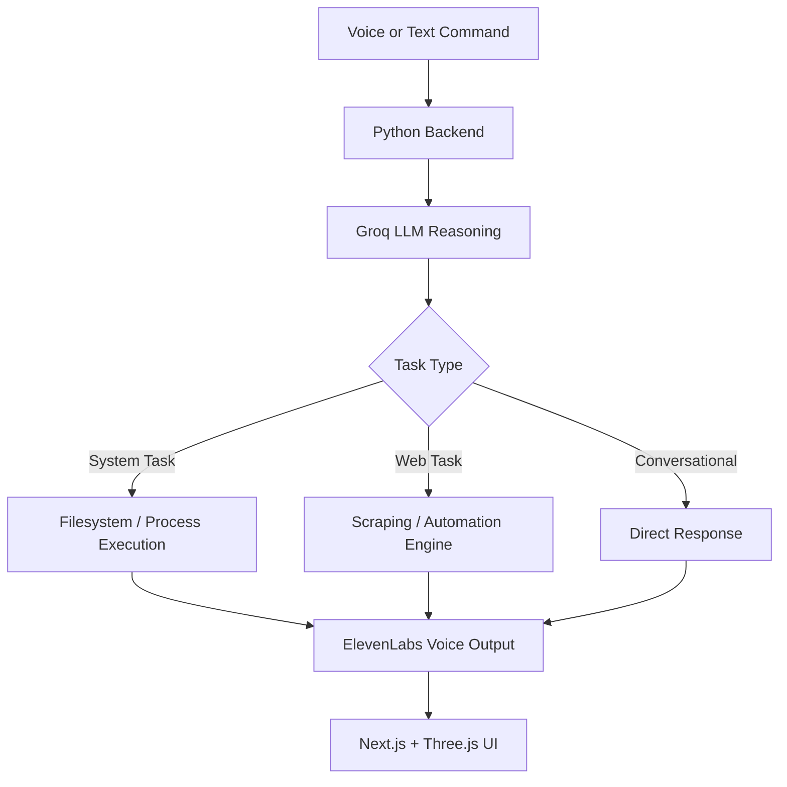

# Barq AI Assistant


A personal desktop AI assistant inspired by Jarvis — built to actually run your machine, not just chat with you. Barq listens, talks back, and executes: it has full access to your computer, can browse and scrape the web, and carries out real tasks on request, all wrapped in a 3D interactive interface.

---

## Overview

Most AI assistants are boxed into a chat window. Barq isn't. It's a control layer over your own desktop — capable of taking a spoken or typed command and turning it into real action, whether that's running a script, pulling data off a website, or managing files. Think less "chatbot," more "always-on operator."

---

## Screenshots

Screenshots coming soon.

---

## Key Features

- **Full System Access** — Executes commands, manages files, and runs tasks directly on the host machine.
- **Web Scraping & Automation** — Pulls live data from the web and automates multi-step tasks on request.
- **Voice Interaction** — Natural, low-latency speech synthesis and input powered by ElevenLabs.
- **Fast LLM Reasoning** — Groq-powered inference for near-instant responses, keeping the assistant feeling alive rather than laggy.
- **Immersive 3D Interface** — A Next.js and Three.js front end gives Barq a real visual presence instead of a plain chat box.
- **Zero Local Model Load** — All reasoning runs through cloud APIs, so the assistant stays fast and light even on modest hardware.

---

## Technology Stack

| Component | Tool |
|---|---|
| Backend | Python |
| Frontend | Next.js, Three.js |
| Voice / Audio | ElevenLabs |
| LLM Inference | Groq API |
| System Control | Python (filesystem, process execution) |
| Web Scraping | Python-based scraping pipeline |

---

## How It Works



---

## Getting Started

### Prerequisites

- Python 3.10+
- Node.js 18+
- A Groq API key
- An ElevenLabs API key

### 1. Clone the repo

```bash
git clone https://github.com/your-username/barq-ai-assistant.git
cd barq-ai-assistant
```

### 2. Backend Setup

```bash
cd backend
python -m venv venv
source venv/bin/activate   # Windows: venv\Scripts\activate
pip install -r requirements.txt
cp .env.example .env       # add your GROQ_API_KEY and ELEVENLABS_API_KEY
python main.py
```

### 3. Frontend Setup

```bash
cd frontend
npm install
npm run dev
```

The UI runs at `http://localhost:3000`, with the backend available at `http://localhost:8000`.

---

## Environment Variables

```env
GROQ_API_KEY=your_groq_api_key_here
ELEVENLABS_API_KEY=your_elevenlabs_api_key_here
ELEVENLABS_VOICE_ID=your_voice_id_here
```

---


---

## Safety Note

Barq has full access to the host machine, including filesystem and process execution. Run it in an environment you trust, review command permissions before granting them, and avoid exposing the backend to the open internet without authentication.

---

## Roadmap

- Vision support (screen understanding, camera input)
- Persistent memory across sessions
- Plugin system for custom tools
- Wake-word activation
- Mobile companion app for remote control

---

## Contributing

This is a personal project, but issues and suggestions are welcome. Fork the repo, create a feature branch, and submit a PR.
